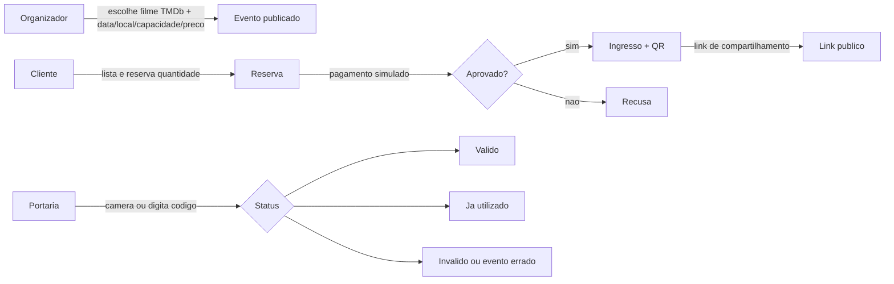

# Desafio Elite Dev — Plano de Execução

Plataforma de Eventos e Ingressos: o organizador publica eventos a partir do catálogo TMDb, o cliente reserva por quantidade (pista), paga de forma simulada, recebe ingresso com QR e pode compartilhar por link; a portaria valida o ingresso na entrada. Entrega em commits separados por funcionalidade, com o fluxo ponta a ponta antes de qualquer opcional.

## Stack e decisões

- **Front-End:** Next.js (App Router) + React. UI consome a API Nest; leitura de QR na portaria via câmera no browser, com digitação manual como fallback.
- **Back-End:** NestJS (Node.js). Autenticação, proxy TMDb, eventos, reservas, pagamento simulado, ingressos e validação de portaria.
- **Banco:** PostgreSQL via Docker Compose no ambiente local. Schema versionado com **Prisma 6** (`apps/api/prisma`) — escolhido em vez do Prisma 7 por integração direta com NestJS CommonJS (sem adapter/ESM).
- **API externa (MVP):** [TMDb](https://developer.themoviedb.org/docs) — filmes em cartaz. Chave de API só no backend; front nunca vê o segredo. Ticketmaster fica fora do MVP.
- **Modelo de reserva (MVP):** quantidade (pista), no espírito do Eventim/Sympla. Mapa de assentos (Ingresso.com) fica como opcional pós-MVP.
- **Pagamento:** simulado no Nest (cenários de confirmação e recusa), sem gateway real no fluxo básico.
- **QR / ingresso:** código opaco gerado e verificável no backend (assinatura HMAC ou equivalente), de forma que não possa ser forjado no cliente. O front só exibe o QR e envia o código para validação.
- **Autenticação:** JWT Bearer com três papéis distintos — `ORGANIZER` (cria/gerencia eventos), `CLIENT` (reserva, paga, vê ingressos), `GATE` (valida na entrada).
- **UI:** identidade visual própria; evitar “AI slop” (mesmo layout genérico de todo projeto gerado). Decisões de design e uso de IA entram no README.
- **Bibliotecas previstas:** class-validator / Zod, bcrypt (hash de senha), `@nestjs/jwt` + Passport, cliente HTTP tipado para TMDb com cache em memória, `qrcode` (ou equivalente) no front para renderizar o código.

## Estrutura do monorepo

```
/
  apps/web/              Next.js (App Router) — páginas públicas, organizador, cliente, portaria
  apps/api/              NestJS — módulos auth, tmdb, events, reservations, tickets, gate
  docker-compose.yml     PostgreSQL (e, opcionalmente depois, api + web)
  .env.example           variáveis sem segredos reais
  docs/PLANO.md          este plano
  README.md              setup, seed, limitações conhecidas, uso de IA, decisões
```

Padrões evidenciados: módulos Nest por domínio, DTOs com validação, guards por role, transações no banco para estoque, Result/erro de domínio claro nas respostas da portaria.

## Fluxo MVP (ponta a ponta)



### Papéis e telas mínimas

| Papel | Consegue fazer no MVP |
| --- | --- |
| Organizador | Login, buscar filme no TMDb, criar/editar/publicar evento (data, local, capacidade, preço), listar os próprios eventos |
| Cliente | Login, navegar eventos publicados, reservar N ingressos, pagar (ok/falha), ver “Meus ingressos” com QR, gerar link de compartilhamento |
| Portaria | Login, escolher/contexto do evento, ler QR pela câmera ou digitar código, ver retorno claro do status |

## Domínio e regras críticas

- **Estoque:** a capacidade do evento limita quantas unidades podem ser vendidas. Reserva + pagamento confirmado decrementam o disponível dentro de transação; concorrência não pode vender a mesma unidade duas vezes (`SELECT … FOR UPDATE`, constraint ou contador atômico).
- **Pagamento simulado:** endpoint que aceita a reserva e retorna sucesso ou recusa (ex.: flag/cenário de teste). Só no sucesso geram-se os ingressos.
- **Ingresso:** um registro por unidade vendida, com `code` verificável, status (`ISSUED` → `USED`), vínculo ao evento e ao cliente.
- **Compartilhamento:** link público com token/código que permite visualizar o ingresso sem impersonar o dono (somente leitura do QR/dados do ingresso).
- **Portaria:** validação idempotente — primeiro scan → `válido` e marca `USED`; segundo → `já utilizado`; código inexistente/assinatura inválida → `inválido`; ingresso de outro evento → `evento errado`.

## Sequência de commits

Um commit por funcionalidade, na ordem abaixo. Só avançar para a próxima etapa com o build/rodando local da etapa atual ok. Opcional só depois do critério de MVP pronto.

1. **chore(setup)** — inicializar monorepo (`apps/web`, `apps/api`), `.gitignore`, `.editorconfig`, Docker Compose do PostgreSQL, `.env.example`, README mínimo com como subir o banco, esqueleto Nest e Next compilando.
2. **feat(db)** — schema `users` (role), `events` (dados do filme TMDb + data/local/capacidade/preço/organizador), `reservations`, `tickets`; índices e constraints de estoque; seed: 1 organizador, 2 clientes, 1 usuário de portaria, ≥1 evento publicado com capacidade disponível. Credenciais do seed documentadas no README.
3. **feat(auth)** — registro (se fizer sentido) e login JWT; hash de senha; guards `RolesGuard` para `ORGANIZER` / `CLIENT` / `GATE`; rotas protegidas no Nest e sessão/token no Next.
4. **feat(tmdb)** — módulo Nest que consulta now playing / search do TMDb, com cache curto e timeout; endpoints internos usados só pelo organizador autenticado.
5. **feat(events)** — CRUD/gerência do organizador (criar a partir de um filme TMDb) + listagem/detalhe públicos dos eventos publicados (data, local, preço, vagas restantes).
6. **feat(reserve-pay)** — cliente reserva quantidade; lock/transação de estoque; checkout com pagamento simulado (confirmação e recusa); estados claros da reserva.
7. **feat(tickets)** — emissão do ingresso com código QR seguro após pagamento ok; área “Meus ingressos”; endpoint/página de compartilhamento por link.
8. **feat(gate)** — tela de portaria (câmera + digitação); API de validação com os quatro retornos; garantia de não validar o mesmo ingresso duas vezes.
9. **docs** — README completo: pré-requisitos, `.env`, Docker, como rodar api/web, contas seed, limitações conhecidas, decisões de arquitetura, seção de uso de IA. Versionar artefatos de processo (este `PLANO.md`) junto.
10. **opcionais (somente após o MVP)** — busca/filtro de eventos, painel rico do organizador, cancelamento com devolução ao estoque, mapa de assentos, Docker Compose full stack, testes automatizados, deploy (Vercel no front; API em plataforma similar — +1 ponto no PDF).

## Fora de escopo (PDF)

Nota fiscal, revenda entre usuários, aplicativo nativo, recuperação de senha, envio de ingresso por e-mail.

## Critérios de “MVP pronto”

Com apenas o seed, o avaliador percorre:

1. Login como organizador / cliente / portaria.
2. Ver ao menos um evento publicado.
3. Reservar N ingressos (pista).
4. Pagamento simulado com sucesso e com recusa.
5. Ver QR em “Meus ingressos” e abrir o link de compartilhamento.
6. Validar na portaria (válido) e repetir (já utilizado); testar código inválido e evento errado.

Preferimos este fluxo inteiro simples e completo a um pedaço sofisticado pela metade.

## Verificação ao final do MVP

- `docker compose up` sobe o Postgres; api e web sobem localmente com as instruções do README.
- Smoke manual do fluxo acima com as contas seed.
- Conferir que a chave TMDb não aparece no bundle do front.
- Conferir que dois clientes concorrentes não ultrapassam a capacidade do evento.

## Pós-MVP (se houver tempo nos 7 dias)

Prioridade sugerida para nota/diferencial: deploy → README polido + uso de IA → busca/filtro → testes básicos → Docker Compose completo → mapa de assentos / cancelamento.
